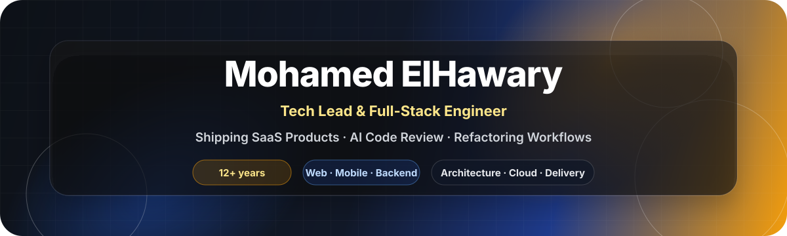

  

  

  
  
  
  

---

## About

Tech lead and full-stack engineer with **12+ years** building startup products across web, mobile, backend, and infrastructure.

I help turn messy product ideas into shipped SaaS systems through clear architecture, full-stack delivery, and AI-assisted review workflows.

I care about the fundamentals that survive every stack change: clear thinking, trust, good people, reliable systems, and shipping habits that hold up under real product pressure.

  <strong>Product Thinking</strong> → <strong>Specs</strong> → <strong>Architecture</strong> → <strong>Database/API</strong> → <strong>Web/Mobile</strong> → <strong>QA</strong> → <strong>Review</strong> → <strong>Release</strong>

---

## Tech I've Shipped With

  

**Frontend:** React · Next.js · Remix · Astro · Vite · Tailwind · TypeScript  
**Mobile:** Flutter · Dart · React Native  
**Backend:** Node.js · Express · NestJS · Python · Django · FastAPI · REST APIs  
**Data:** PostgreSQL · Drizzle ORM · RLS · database design  
**Cloud & Delivery:** AWS · Azure · Cloudflare · Docker · GitHub Actions  
**Architecture & Workflows:** MVC · design patterns · code review · refactoring · QA · AI coding agents

  
  
  
  
  
  
  

---

## What I Bring

### 🎯 Product clarity

Turning vague product needs into clear technical decisions, practical scope, and shippable systems.

### ⚙️ Full-stack delivery

Building across frontend, mobile, backend, database, infrastructure, QA, and release workflows.

### 🤖 AI review loops

Using AI coding agents carefully with specs, review gates, refactoring discipline, and human judgment.

---

## Featured Public Work

  

### [Hawary Workflow Skills](https://github.com/mo-hawary/hawary-workflow-skills)

Reusable workflow skills for AI coding agents, repo audits, code review, dependency checks, local development safety, and practical engineering automation.

Public focus:

- Agent-readable engineering routines
- Codex and Claude Code workflows
- PR review and repo audit habits
- Dependency, security, and local workflow checks
- Practical tooling for better software delivery

---

## Current Focus

- SaaS product systems from idea to release
- AI-assisted code review and refactoring workflows
- Cloud-first, database-backed product architecture
- Practical MVP delivery without unnecessary infrastructure weight
- Clear specs, review loops, and maintainable release habits

---

## Education & Foundations

**Information Technology Institute (ITI)**  
Postgraduate Degree · Frontend Diploma · Grade: A+

**Udacity**  
Nanodegree · Full Stack Development · 2020 · Grade: Excellent

**Alexandria University**  
Bachelor of Law - LLB · Law English Department · 2009 - 2013

The law background still helps: structured thinking, argumentation, contracts, edge cases, and reading details before making decisions.

---

  
<strong>Experience Snapshot</strong>

 

- **Senior Software Engineer** — EButler / ENABLE Tech · Nov 2021 - Jan 2026 · Remote · Full-time
- **Senior Frontend Developer** — Baeynh · Dec 2022 - Jun 2023 · Remote · Part-time
- **Senior Frontend Engineer** — Bulx · May 2021 - Jun 2022 · Remote · Part-time
- **Freelance Web Developer** — Independent · Dec 2018 - Dec 2021 · Full-time
- **Senior Frontend Developer** — Technic · Sep 2020 - May 2021 · Part-time

  
<strong>Selected Certifications</strong>

 

### AI, APIs & Automation

- ChatGPT's Operator: Automating Everyday Tasks with AI Agents · LinkedIn · 2025
- Learning REST APIs · LinkedIn · 2025

### Architecture & Engineering Foundations

- Software Architecture: From Developer to Architect · LinkedIn · 2025
- Software Architecture Foundations · LinkedIn · 2025
- Programming Foundations: Design Patterns · LinkedIn · 2024
- Programming Foundations: Discrete Mathematics · LinkedIn · 2024
- Programming Foundations: SDKs · LinkedIn · 2024
- TypeScript Fundamentals · Information Technology Institute · 2021
- Problem Solving · HackerRank · 2021

### Leadership & Communication

- Inclusive Tech: Leadership and Management · LinkedIn · 2024
- Moving from Developer to Engineering Manager · LinkedIn · 2024
- Leadership: Practical Skills · LinkedIn · 2023
- Effective Technical Communication · LinkedIn · 2023
- Succeeding as a First-Time Tech Manager · LinkedIn · 2023

---

## How I Think

> Product before code. Architecture before sprawl. Data before features. Review before regret. Small systems before heavy systems. Shipping habits before heroic fixes.

Chess teaches me strategy. Songwriting teaches me timing, structure, rhythm, and taste. Architecture sits somewhere between both.

  <strong>Founder-grade engineering for real products, clear systems, and teams that need to ship.</strong>

