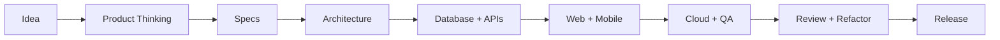

  

  

  
  
  
  

 

<table>
  <tr>
    <td width="50%" valign="top">
      <h3>About</h3>
      

        Tech lead and full-stack engineer with <strong>12+ years</strong> building startup products across web, mobile, backend, and infrastructure.
      

      

        I turn messy product uncertainty into clear specs, reliable systems, review loops, and shipping habits that hold up under real product pressure.
      

    </td>
    <td width="50%" valign="top">
      <h3>Current Edge</h3>
      <ul>
        <li>SaaS product delivery</li>
        <li>AI code review workflows</li>
        <li>Refactoring and architecture reviews</li>
        <li>Frontend, mobile, backend, and cloud</li>
        <li>Founder-grade MVP execution</li>
      </ul>
    </td>
  </tr>
</table>

## How I Turn Ideas Into Systems

## Tech I Have Shipped With

  

<table>
  <tr>
    <td align="center" width="25%"><strong>Frontend</strong> React · Next.js · Remix · Astro · Vite · Tailwind</td>
    <td align="center" width="25%"><strong>Mobile</strong> Flutter · Dart · React Native</td>
    <td align="center" width="25%"><strong>Backend</strong> Node.js · Express · NestJS · Django · FastAPI</td>
    <td align="center" width="25%"><strong>Cloud</strong> AWS · Azure · Cloudflare · Docker · GitHub Actions</td>
  </tr>
  <tr>
    <td align="center"><strong>Data</strong> PostgreSQL · Drizzle ORM · RLS · database design</td>
    <td align="center"><strong>Delivery</strong> Code review · QA · release workflows</td>
    <td align="center"><strong>Architecture</strong> MVC · design patterns · refactoring</td>
    <td align="center"><strong>AI Workflows</strong> Codex · Claude Code · agent-readable routines</td>
  </tr>
</table>

  
  
  
  
  
  
  

## What I Bring

<table>
  <tr>
    <td width="33%" valign="top">
      <h3>Product Clarity</h3>
      
Turning vague product needs into clear technical decisions, practical scope, and shippable systems.

    </td>
    <td width="33%" valign="top">
      <h3>Full-Stack Delivery</h3>
      
Building across frontend, mobile, backend, database, infrastructure, QA, and release workflows.

    </td>
    <td width="33%" valign="top">
      <h3>AI Review Loops</h3>
      
Using AI coding agents carefully with specs, review gates, refactoring discipline, and human judgment.

    </td>
  </tr>
</table>

## Featured Public Work

  

<table>
  <tr>
    <td width="50%" valign="top">
      <h3><a href="https://github.com/mo-hawary/hawary-workflow-skills">Hawary Workflow Skills</a></h3>
      
Reusable workflow skills for AI coding agents, repo audits, code review, dependency checks, and practical engineering automation.

    </td>
    <td width="50%" valign="top">
      <h3><a href="https://mohawary.com">mohawary.com</a></h3>
      
My canonical website and public developer profile.

    </td>
  </tr>
</table>

## Education & Foundations

<table>
  <tr>
    <td width="33%" valign="top">
      <h3>Information Technology Institute</h3>
      
<strong>Postgraduate Degree</strong> Frontend Diploma Grade: A+

    </td>
    <td width="33%" valign="top">
      <h3>Udacity</h3>
      
<strong>Nanodegree</strong> Full Stack Development 2020 · Grade: Excellent

    </td>
    <td width="33%" valign="top">
      <h3>Alexandria University</h3>
      
<strong>Bachelor of Law</strong> LLB, Law English Department 2009 - 2013

    </td>
  </tr>
</table>

  
<strong>Experience Snapshot</strong>

   
  <table>
    <tr>
      <td><strong>Senior Software Engineer</strong></td>
      <td>EButler / ENABLE Tech</td>
      <td>Nov 2021 - Jan 2026</td>
      <td>Remote · Full-time</td>
    </tr>
    <tr>
      <td><strong>Senior Frontend Developer</strong></td>
      <td>Baeynh</td>
      <td>Dec 2022 - Jun 2023</td>
      <td>Remote · Part-time</td>
    </tr>
    <tr>
      <td><strong>Senior Frontend Engineer</strong></td>
      <td>Bulx</td>
      <td>May 2021 - Jun 2022</td>
      <td>Remote · Part-time</td>
    </tr>
    <tr>
      <td><strong>Freelance Web Developer</strong></td>
      <td>Independent</td>
      <td>Dec 2018 - Dec 2021</td>
      <td>Full-time</td>
    </tr>
    <tr>
      <td><strong>Senior Frontend Developer</strong></td>
      <td>Technic</td>
      <td>Sep 2020 - May 2021</td>
      <td>Part-time</td>
    </tr>
  </table>

  
<strong>Selected Certifications</strong>

   

  <h3>AI, APIs & Automation</h3>
  <ul>
    <li>ChatGPT's Operator: Automating Everyday Tasks with AI Agents · LinkedIn · 2025</li>
    <li>Learning REST APIs · LinkedIn · 2025</li>
  </ul>

  <h3>Architecture & Engineering Foundations</h3>
  <ul>
    <li>Software Architecture: From Developer to Architect · LinkedIn · 2025</li>
    <li>Software Architecture Foundations · LinkedIn · 2025</li>
    <li>Programming Foundations: Design Patterns · LinkedIn · 2024</li>
    <li>Programming Foundations: Discrete Mathematics · LinkedIn · 2024</li>
    <li>Programming Foundations: SDKs · LinkedIn · 2024</li>
    <li>TypeScript Fundamentals · Information Technology Institute · 2021</li>
    <li>Problem Solving · HackerRank · 2021</li>
  </ul>

  <h3>Leadership & Communication</h3>
  <ul>
    <li>Inclusive Tech: Leadership and Management · LinkedIn · 2024</li>
    <li>Moving from Developer to Engineering Manager · LinkedIn · 2024</li>
    <li>Leadership: Practical Skills · LinkedIn · 2023</li>
    <li>Effective Technical Communication · LinkedIn · 2023</li>
    <li>Succeeding as a First-Time Tech Manager · LinkedIn · 2023</li>
  </ul>

## How I Think

<table>
  <tr>
    <td align="center">Product before code</td>
    <td align="center">Architecture before sprawl</td>
    <td align="center">Data before features</td>
  </tr>
  <tr>
    <td align="center">Review before regret</td>
    <td align="center">Small systems before heavy systems</td>
    <td align="center">Shipping habits before heroic fixes</td>
  </tr>
</table>

 

  Chess teaches me strategy. Songwriting teaches me timing, structure, rhythm, and taste.
   
  Architecture sits somewhere between both.

  <strong>Founder-grade engineering for real products, clear systems, and teams that need to ship.</strong>

  

